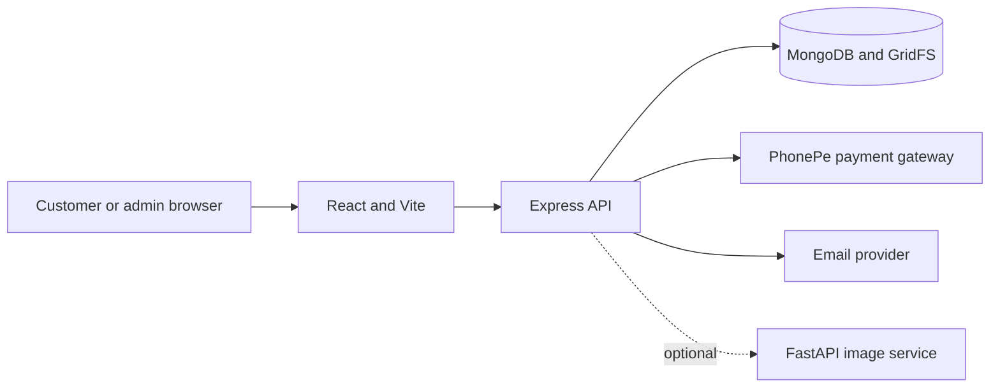

# Yamini Flex Printing

A printing and design storefront with a customer catalogue, online design editor, template customization, ordering and payment flows, plus an authenticated admin panel for managing the store and customers.

## Contents

- [Project structure](#project-structure)
- [Requirements](#requirements)
- [Run locally](#run-locally)
- [Configuration](#configuration)
- [Customer workflow](#customer-workflow)
- [Admin workflow](#admin-workflow)
- [Optional local AI image service](#optional-local-ai-image-service)
- [Tests and quality checks](#tests-and-quality-checks)
- [Deployment notes](#deployment-notes)

## Project structure

```text
frontend/   React 19 and Vite customer website, design editor, and admin UI
backend/    Express API, MongoDB models, authentication, orders, payments, and file storage
ai-server/  Optional FastAPI service for generating image artwork and variations
```

The frontend calls the Express API. The backend stores application data in MongoDB and uploaded assets in MongoDB GridFS. If enabled, the backend calls the local AI service; model credentials are never sent to the browser.



## Requirements

- Node.js compatible with Vite 8 and npm.
- MongoDB running locally or a MongoDB connection string.
- Python 3.11 or 3.12 only if running the optional AI image service.
- For practical local AI image generation, an NVIDIA CUDA GPU is recommended. See [ai-server/README.md](ai-server/README.md) for hardware and model-license details.

There is no root npm script. Install dependencies and run each JavaScript service from its own directory.

## Run locally

### 1. Start MongoDB

Start a local MongoDB server, or provide an Atlas/hosted URI through `MONGODB_URI`. The default local database is `mongodb://127.0.0.1:27017/yamini_flex_printing`.

### 2. Configure and start the backend

```powershell
cd backend
Copy-Item .env.example .env
npm install
```

Set a unique `JWT_SECRET` in `backend/.env` before signing in. The backend defaults to port `5000`.

To create the initial admin account, set `SEED_ADMIN_USERNAME` and `SEED_ADMIN_PASSWORD` in `backend/.env`, then run:

```powershell
npm run seed:admin
```

If those variables are omitted, the seed script uses the development defaults `admin` / `Yamini@123`. Change them before use and do not use these defaults in a deployed environment. To insert the default categories, run `npm run seed:categories`.

Start the API in its own terminal:

```powershell
npm run dev
```

Check that the API is listening at `http://localhost:5000/api/health`.

### 3. Configure and start the frontend

In a second terminal:

```powershell
cd frontend
npm install
```

The API defaults to `http://localhost:5000/api`. To use a different backend, create `frontend/.env.local`:

```dotenv
VITE_API_BASE_URL=http://localhost:5000/api
```

Start Vite:

```powershell
npm run dev
```

Open the URL Vite prints, normally `http://localhost:5173`.

### 4. Optional: start the local AI image service

Follow the OS-specific installation, PyTorch, GPU, model, and license instructions in [ai-server/README.md](ai-server/README.md). In brief, install the Python dependencies in a virtual environment, configure `ai-server/.env`, and start the service on port `8000`:

```powershell
cd ai-server
py -3.12 -m venv .venv
.venv\Scripts\Activate.ps1
python -m pip install -r requirements.txt
Copy-Item .env.example .env
uvicorn app:app --host 127.0.0.1 --port 8000
```

Set the backend's `AI_SERVER_URL=http://127.0.0.1:8000` and the required provider settings in `backend/.env`. The AI service is optional; the storefront, catalogue, and standard order workflow do not require it.

## Configuration

The backend loads `backend/.env` with dotenv. The provided example contains AI-related settings; add other settings as needed for enabled integrations.

| Variable | Purpose |
| --- | --- |
| `PORT` | Express port; defaults to `5000`. |
| `MONGODB_URI` | MongoDB connection string; defaults to the local `yamini_flex_printing` database. |
| `JWT_SECRET` | Secret used for admin and customer authentication tokens. Set a long, private value. |
| `JWT_EXPIRES_IN` | Token lifetime; defaults to `7d`. |
| `SEED_ADMIN_USERNAME` / `SEED_ADMIN_PASSWORD` | Initial admin credentials used by `npm run seed:admin`. |
| `VITE_API_BASE_URL` | Frontend API base URL; defaults to `http://localhost:5000/api`. Set at frontend build time. |
| `PHONEPE_CLIENT_ID`, `PHONEPE_CLIENT_SECRET`, `PHONEPE_CLIENT_VERSION` | PhonePe SDK credentials and version. |
| `PHONEPE_ENV` | `SANDBOX` or `PRODUCTION`; defaults to `SANDBOX`. |
| `FRONTEND_URL`, `BACKEND_PUBLIC_URL` | Public URLs used in the PhonePe checkout/return flow. |
| `EMAIL_USER`, `EMAIL_APP_PASSWORD` | Email account credentials for configured order/customer email messages. |
| `AI_SERVER_URL`, `AI_SERVER_TIMEOUT` | Optional FastAPI image service URL and request timeout. |
| `AI_IMAGE_PROVIDER`, `AI_EDIT_PROVIDER` | Select image generation and editing providers. |
| `AI_VISION_PROVIDER`, `AI_VISION_MODEL`, `GEMINI_API_KEY`, `AI_API_KEY` | Optional vision/OCR provider configuration and credentials. |
| `DESIGN_RENDER_FONT` | Preferred font stack for generated/rendered design text. |

Never commit `.env` files, payment credentials, email app passwords, or AI API keys. Keep provider secrets in the backend environment, not in `frontend/.env*` variables prefixed with `VITE_`.

## Customer workflow

1. Browse the Home page, categories, latest designs, popular designs, or the full catalogue. Catalogue search, category filters, and sorting are applied by the API.
2. Open a design detail page or browse templates. Templates can be customized in the editor when editable layers are available.
3. Use the design editor to personalize supported design text and images. Export and save actions depend on the selected design/template workflow.
4. Start an order from a design, provide order details, and attach customer artwork when required. Customer uploads reject PSD master files; supported print artwork formats are checked by the backend.
5. Select the available payment method. PhonePe checkout is available when its backend credentials and public callback URLs are configured; other payment choices depend on the shop's configured workflow.
6. View the order confirmation and use the order tracking page. Customer registration/login enables the protected account area and order history.

## Admin workflow

1. Open `/admin/login` and sign in with the seeded admin account.
2. Use **Designs** to upload/manage designs and previews; use **Categories** to organize the catalogue. PSD templates require a separate browser-friendly preview image.
3. Use **Templates** to create and manage editable templates and their assets.
4. Use **Website Settings** to update shop identity, contact details, colors, payment preferences, and homepage content. Under **Homepage Sections**, edit product cards and inspiration gallery entries, enter an image URL and save it, or choose **Upload from device**. Saved images are served through the backend file API and displayed on the public homepage.
5. Use **Orders** to review and update incoming work, and **Customers** and **Analytics** to manage customer records and review store activity.
6. Use **Profile Settings** to maintain the admin account.

Admin APIs are protected by the admin token. Customer APIs use customer authentication where required. Public catalogue, category, template, file, and homepage settings endpoints are separate from protected management routes.

## Optional local AI image service

The FastAPI service provides text-to-image artwork and image variations. It is not required to operate the store. Generated artwork is not guaranteed to contain legible text or be print-resolution; keep important copy editable in the design editor and inspect final output at its intended print size. The default model has separate license requirements for commercial use. Review [ai-server/README.md](ai-server/README.md) before enabling the service.

## Tests and quality checks

Backend tests use Node's built-in test runner:

```powershell
cd backend
npm test
```

Frontend production build and lint:

```powershell
cd frontend
npm run build
npm run lint
```

The frontend package does not currently define an `npm test` script.

## Deployment notes

- Deploy the frontend and backend as separate services and set `VITE_API_BASE_URL` to the public API URL before building the frontend.
- Set a strong, private `JWT_SECRET`; replace development admin credentials and use PhonePe production credentials only in the production environment.
- Use a persistent MongoDB deployment: GridFS stores uploaded design, template, and homepage image files in MongoDB.
- Configure `FRONTEND_URL`, `BACKEND_PUBLIC_URL`, CORS, payment return URLs, email delivery, and external AI service access for the deployed hostnames.
- Keep the local AI service on a private network and allow only the backend to call it. Review model terms and configure resource limits, output retention, and monitoring before production use.
